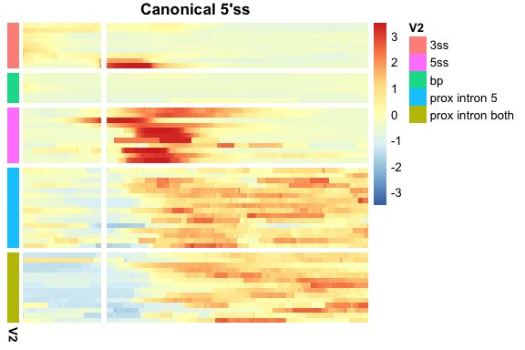
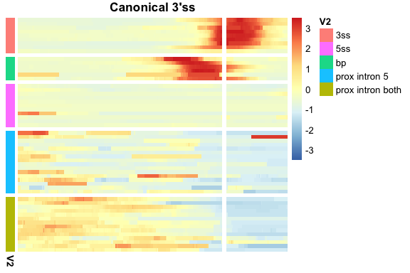
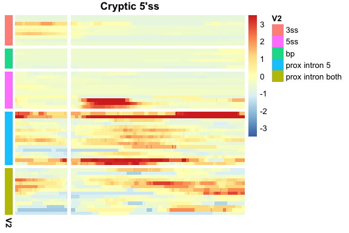
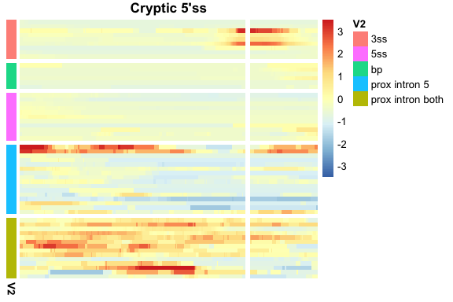

## Figure 4

### Figure 4 C

Cryptic 3’ss maintain U2AF recognition while lacking SF3 complex
binding. Cryptic 5’ss lack binding of canonical factors such as AQR and
PRPF8. Heatmap indicates peak coverage (requiring \>= 8-fold and p value
\<= 10^-3) in immunoprecipitations versus paired size-matched input in
published ENCODE data. Color indicates average peak density across 500
splice junctions. Heatmap is clustered based on previous annotations
(Van Nostrand Genome Biology 2020).

``` r
# Load R libs ####
library(pheatmap)

# Load data ####
ki_5ss <- read.csv(
  "../../data/eclip_overlaps/summary_tables/ki_5ss_summary.csv",
  row.names = 1)
ki_3ss <- read.csv(
  "../../data/eclip_overlaps/summary_tables/ki_3ss_summary.csv",
  row.names = 1)

dhx15_5ss <- read.csv(
  "../../data/eclip_overlaps/summary_tables/cryptic_5ss_summary.csv",
  row.names = 1)
dhx15_3ss <- read.csv(
  "../../data/eclip_overlaps/summary_tables/cryptic_3sss_summary.csv",
  row.names = 1)

# Define column annotation #####
anno_col_3ss <- data.frame(distance = c(rev(seq(1, 250)), seq(1, 75)))
anno_col_5ss <- data.frame(distance = c(rev(seq(1, 75)), seq(1, 250)))

# Define row annotation ####
anno_row <- read.csv(
  "../../data/eclip_overlaps/summary_tables/label_annotation.csv",
  row.names = 1, header = FALSE)


# Create heatmaps ####
pheatmap(ki_5ss,
         cluster_cols = FALSE,
         cluster_rows = FALSE,
         gaps_col = 75,
         breaks = seq(-3.5, 3.5, length = 101),
         show_rownames = FALSE, show_colnames = FALSE,
         gaps_row = c(9, 15, 26, 42),
         annotation_row = anno_row,
         main = "Canonical 5'ss",
         fontsize_row = 8
)
```



``` r
pheatmap(ki_3ss,
         cluster_cols = FALSE,
         cluster_rows = FALSE,
         gaps_col = 250,
         breaks = seq(-3.5, 3.5, length = 101),
         show_rownames = FALSE, show_colnames = FALSE,
         gaps_row = c(9, 15, 26, 42),
         main = "Canonical 3'ss",
         annotation_row = anno_row,
)
```



``` r
pheatmap(dhx15_5ss,
         cluster_cols = FALSE,
         cluster_rows = FALSE,
         gaps_col = 75,
         breaks = seq(-3.5, 3.5, length = 101),
         show_rownames = FALSE, show_colnames = FALSE,
         gaps_row = c(9, 15, 26, 42),
         main = "Cryptic 5'ss",
         annotation_row = anno_row
)
```



``` r
pheatmap(dhx15_3ss,
         cluster_cols = FALSE,
         cluster_rows = FALSE,
         gaps_col = 250,
         breaks = seq(-3.5, 3.5, length = 101),
         show_rownames = FALSE, show_colnames = FALSE,
         gaps_row = c(9, 15, 26, 42),
         main = "Cryptic 5'ss",
         annotation_row = anno_row
)
```


