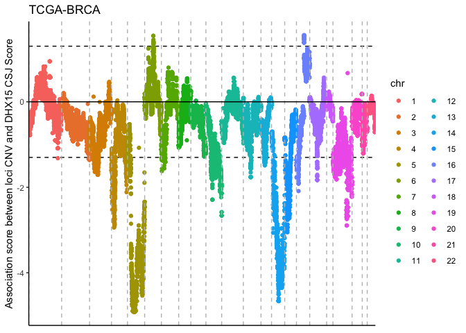
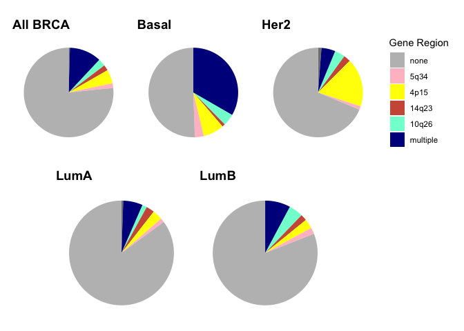
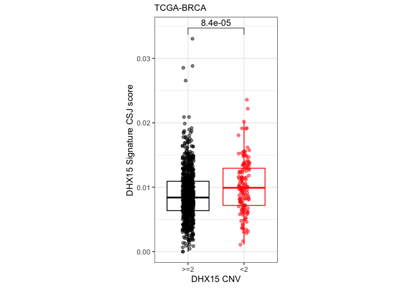
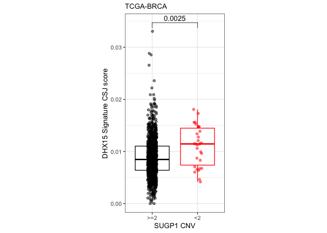

## Figure 7

### Figure 7 A

Manhattan plot depicts association of gene CNV change with DHX15 CSJ
score. Genes with negative association suggests that loss of a given
gene correlates with increased CSJ score.

``` r
#Load GWAS results ####
tcga <- read.delim("../../data/tcga_brca/tcga_brca_cnv_csj_genome_wide_association.tsv")

# Correct for multiple testing ####
tcga$p_adj <- p.adjust(tcga$pvalue, method = "BH")

# Calculate score after multiple testing correction ####
tcga$score_adj <- -log10(tcga$p_adj)
tcga$score_adj[tcga$difference < 0] <-
  (tcga$score_adj[tcga$difference < 0]) * (-1)

# Create TCGA BRCA Manhatten plot ####
tcga <- tcga[tcga$chr %in% as.character(1:22), ]
tcga$chr <- factor(tcga$chr, levels = as.character(1:22))

aframe <- tcga
aframe$gene <- factor(aframe$gene,
                      levels = aframe$gene[order(aframe$chr, aframe$pos)])
aframe <- aframe[order(aframe$gene), ]

ggplot(aframe,
       aes(gene, (-1) * score_adj, color = chr)) +
  labs(title = "TCGA-BRCA",
       y = "Association score between loci CNV and DHX15 CSJ Score") +
  geom_hline(yintercept = c(-log10(0.05), log10(0.05)),
             linetype = "dashed") +
  geom_point() +
  geom_vline(xintercept = match(unique(aframe$chr), aframe$chr),
             linetype = "dashed", color = "grey") +
  geom_hline(yintercept = 0) +
  theme_classic() +
  theme(axis.title.x = element_blank(),
        axis.text.x = element_blank(),
        axis.ticks.x = element_blank()
        )
```



### Figure 7 B

Pie chart depicts the percent of tumors with deletion of none, one, or
multiple of these genes across all tumors or by individual subtype

``` r
#Load TCGA CNV data
load("../../data/tcga_brca/tcga_brca_cnv.RData")

# Load recount data junction score ####
usage <- read.csv("../../data/tcga_brca/tcga_brca_csj_usage.csv",
                  row.names = 1)
ki_counts <- read.csv("../../data/tcga_brca/tcga_brca_known_intron_counts.csv",
                      row.names = 1)
metadata <- read.csv("../../data/tcga_brca/tcga_brca_metadata.csv")

samples <- unlist(lapply(metadata$tcga_barcode, function(x) {
  paste(strsplit(x, "-", fixed = TRUE)[[1]][1:4], collapse = "-")
  }))
metadata$id <- samples

colnames(usage) <- colnames(ki_counts) <- samples
usage[is.na(usage)] <- 0

ok <- intersect(colnames(cnv_assay), colnames(usage))

genes <- c("DHX15", "WWC1", "INPP5A", "DHX34", "ESR2")

dels <- apply(cnv_assay[genes, match(ok, colnames(cnv_assay))], 2, function(x) {
  x <- as.numeric(x < 2)
  if (sum(x) == 0) return("none")
  if (sum(x) > 1) return("multiple")
  if (sum(x) == 1) return(genes[which(x == 1)])
})
subtype <- meta$paper_BRCA_Subtype_PAM50[match(ok, colnames(cnv_assay))]
```

    ## Loading required package: S4Vectors

    ## Loading required package: stats4

    ## Loading required package: BiocGenerics

    ## 
    ## Attaching package: 'BiocGenerics'

    ## The following objects are masked from 'package:stats':
    ## 
    ##     IQR, mad, sd, var, xtabs

    ## The following objects are masked from 'package:base':
    ## 
    ##     anyDuplicated, aperm, append, as.data.frame, basename, cbind,
    ##     colnames, dirname, do.call, duplicated, eval, evalq, Filter, Find,
    ##     get, grep, grepl, intersect, is.unsorted, lapply, Map, mapply,
    ##     match, mget, order, paste, pmax, pmax.int, pmin, pmin.int,
    ##     Position, rank, rbind, Reduce, rownames, sapply, setdiff, sort,
    ##     table, tapply, union, unique, unsplit, which.max, which.min

    ## 
    ## Attaching package: 'S4Vectors'

    ## The following objects are masked from 'package:base':
    ## 
    ##     expand.grid, I, unname

``` r
chr_bands <- c(DHX15 = "4p15",
               WWC1 = "5q34",
               DHX34 = "19q13",
               INPP5A = "10q26",
               ESR2 = "14q23",
               multiple = "multiple",
               none = "none")
asplit <- split(1:length(ok), subtype)
asplit <- asplit[c("Basal", "Her2", "LumA", "LumB", "Normal")]

brca <- lapply(asplit, function(x) {
   as.data.frame(table(chr_bands[dels][x]))
})
all_brca <- as.data.frame(table(chr_bands[dels]))
colnames(all_brca) <- c("Var1", "Freq")
brca[["All BRCA"]] <- all_brca

farben <- c("grey", "blue4", "aquamarine", "yellow", "purple", "coral3", "pink")
names(farben) <- unique(chr_bands[dels])

p <- lapply(names(brca), function(x) {
  d <- brca[[x]]
  d$Var1 <- factor(d$Var1,
                      levels = c("none", "5q34", "4p15", "14q23",
                                 "10q26", "multiple"))
  ggplot(data = d, aes(x = "", y = Freq, fill = Var1)) +
    geom_bar(width = 1, stat = "identity") +
    coord_polar("y", start = 0) +
    labs(title = x, x = "", y = "", fill = "Gene Region") +
    scale_fill_manual(values = farben) +
    theme_minimal() +
    theme(
      axis.title.x = element_blank(),
      axis.title.y = element_blank(),
      panel.border = element_blank(),
      panel.grid = element_blank(),
      axis.ticks = element_blank(),
      axis.text = element_blank(),
      plot.title = element_text(size = 14, face = "bold"),
      legend.position = "none"
    )
})

(p[[6]] + p[[1]] + p[[2]] + theme(legend.position = "right")) /
  (p[[3]] + p[[4]])
```



### Figure 7 C

Box plot depicts CSJ score of tumors with (CNV\<2) and without (CNV\>=2)
DHX15 loss (median (line), Q1 to Q3 quartile values (boundaries of the
box), and range (whiskers).

``` r
score <- unlist(lapply(colnames(usage), function(x) {
  ok <- which(ki_counts[, x] > 100)
  mean(usage[ok, x])
}))
names(score) <- colnames(usage)

# Split CNV vs score by subtype ####
aframe3 <- data.frame(score = score[ok],
                     deletions = dels,
                     DHX15_cnv = cnv_assay["DHX15",
                                           match(ok, colnames(cnv_assay))],
                     subtype)

aframe3$cnv <- ">=2"
aframe3[which(aframe3$DHX15_cnv < 2), "cnv"] <- "<2"
aframe3$cnv <- factor(aframe3$cnv, levels = c(">=2", "<2"))
ggplot(aframe3, aes(x = cnv, y = score, color = cnv)) +
  geom_boxplot(outlier.colour = NA) +
  geom_jitter(alpha = 0.5, width = 0.1) +
  scale_color_manual(values = c("black", "red")) +
  labs(subtitle = "TCGA-BRCA", y = "DHX15 Signature CSJ score",
       x = "DHX15 CNV") +
  stat_compare_means(comparisons = list(c(1, 2)), method = "wilcox.test") +
  theme_bw() +
  theme(legend.position = "none",
        aspect.ratio = 2)
```

    ## [1] FALSE



### Figure 7 D

Box plot depicts CSJ score of tumors with (CNV\<2) and without (CNV\>=2)
SUGP1 loss (median (line), Q1 to Q3 quartile values (boundaries of the
box), and range (whiskers).

``` r
aframe2 <- data.frame(score = score[ok],
                     deletions = dels,
                     SUGP1_cnv = cnv_assay["SUGP1",
                                           match(ok, colnames(cnv_assay))],
                     subtype)

aframe2$cnv <- ">=2"
aframe2[which(aframe2$SUGP1_cnv < 2), "cnv"] <- "<2"
aframe2$cnv <- factor(aframe2$cnv, levels = c(">=2", "<2"))
ggplot(aframe2, aes(x = cnv, y = score, color = cnv)) +
  geom_boxplot(outlier.color = NA) +
  geom_jitter(alpha = 0.5, width = 0.1) +
  scale_color_manual(values = c("black", "red")) +
  labs(subtitle = "TCGA-BRCA", y = "DHX15 Signature CSJ score",
       x = "SUGP1 CNV") +
  stat_compare_means(comparisons = list(c(1, 2)), method = "wilcox.test") +
  theme_bw() +
  theme(legend.position = "none",
        aspect.ratio = 2)
```

    ## [1] FALSE


